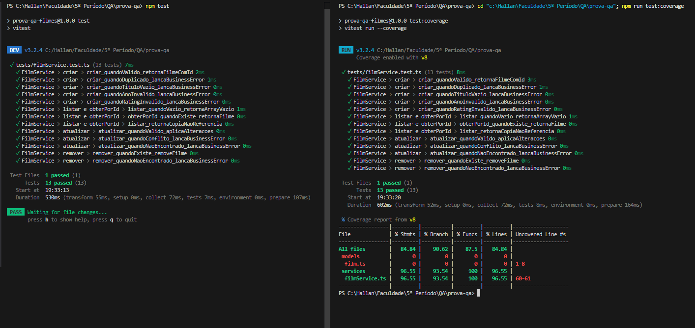

# Prova QA - CRUD de Filmes (TypeScript)

Projeto simples em TypeScript que implementa um CRUD para filmes e uma suíte de testes unitários usando Vitest.

## Regras de Negócio Testadas

1. Título obrigatório: um filme deve ter um título não vazio.
2. Ano obrigatório e numérico: o ano deve ser entre 1888 e (ano atual + 1).
3. Classificação opcional: se informado, deve ser um dos valores: G, PG, PG-13, R, NC-17.
4. Duplicidades: não é permitido criar dois filmes com o mesmo título e ano. Ao atualizar, a unicidade também é verificada (não pode colidir com outro filme existente).
6. Remoção: ao remover um filme que não existe, uma exceção de negócio é lançada.

Essas regras estão agrupadas e testadas nos testes unitários (ver `tests/filmService.test.ts`).

## Rodando localmente

Pré-requisitos: Node.js 18+ e npm

1. Instale dependências:

```
npm install
```

2. Rodar os testes (modo watch):

```
npm test
```

3. Rodar os testes e gerar relatório de coverage:

```
npm run test:coverage
```

O relatório de coverage será exibido no terminal e também deixado em `coverage/` (lcov).

## O que está incluso

- Código-fonte em `src/` (modelos e serviço)
- Testes em `tests/` (Vitest)
- Configuração TypeScript e Vitest

## Observações

## Print teste

Abaixo está o print do resultado dos testes (relatório de coverage gerado localmente):



Este repositório foi criado como solução da prova de QA.